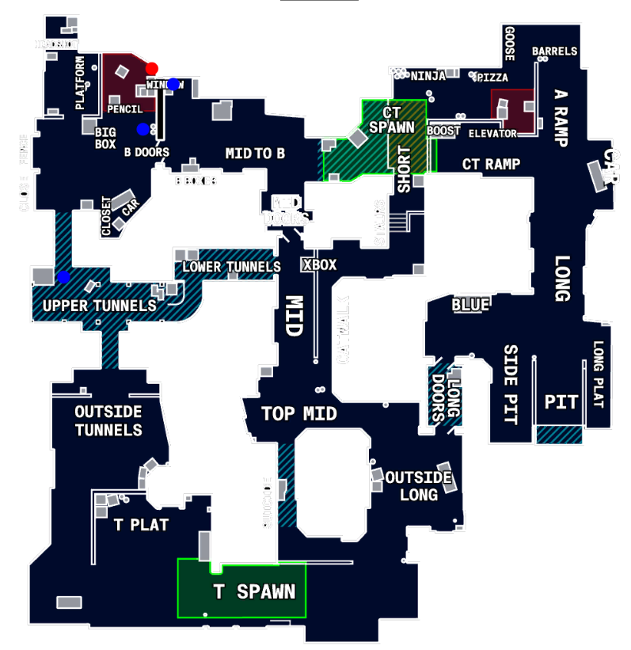

<h1 style="text-align: center;"> Omar's CSRadar </h1>

Hello, this is yet another counter-strike trainer written in Rust and a wee bit of react. A lot of inspiration was taken from [cs2_webradar](https://github.com/clauadv/cs2_webradar) so please check out their repository! Mainly, I also use WebSockets here to push player information to the front end.

As always, this is for pure educational purposes and should not be used in competitive settings. This program **does not attempt** to bypass any detection mechanisms (such as VAC / FACEIT / ect.), so it is very easily detected.

<h2 style="text-align: center;"> Preview </h2>



## Installation

The pre-requisites to running this program is to first have the following installed on your computer:

- [Rust-lang](https://www.rust-lang.org/)
- [NodeJs](https://nodejs.org/en/download)

**Backend:**

```ps1
(CSRadar)$ cargo build
```

**Frontend:**

```ps1
(CSRadar)$ cd frontend
(CSRadar/frontend)$ npm install -g
(CSRadar/frontend)$ npm run build
```

## Usage

**Backend:**

```ps1
(CSRadar)$ cargo run 2>$null
```

**Frontend:**

```ps1
(CSRadar)$ cd frontend
(CSRadar/frontend)$ serve -s build
```

- Now browse `http://localhost:3000` for the radar UI.
- *For debugging purposes, the websocket is on `ws://localhost:3030/ws`*

## Development

**Backend:**

```ps1
cargo run
```

**Frontend:**

```ps1
npm start
```

## To update offsets

Offsets are pulled from [CS2-OFFSETS](https://github.com/sezzyaep/CS2-OFFSETS). To pull the latest offsets, run:

```ps1
(CSRadar)$ ./bin/update_offsets.ps1
```
